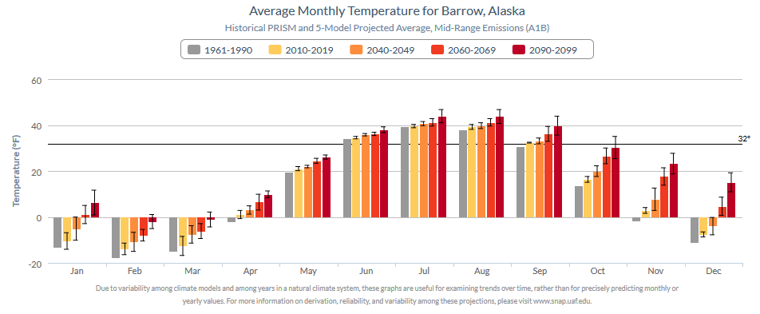

# Community Charts v4 Lite
Matthew Leonawicz  

##
##
##
##
### Introduction

An example plot taken from the updated <code>Community Charts version 4 Lite</code> production suite.

##

<iframe srcdoc=' &lt;!doctype HTML&gt;
&lt;meta charset = &#039;utf-8&#039;&gt;
&lt;html&gt;
  &lt;head&gt;
    
    &lt;script src=&#039;//code.jquery.com/jquery-1.9.1.min.js&#039; type=&#039;text/javascript&#039;&gt;&lt;/script&gt;
    &lt;script src=&#039;//code.highcharts.com/highcharts.js&#039; type=&#039;text/javascript&#039;&gt;&lt;/script&gt;
    &lt;script src=&#039;//code.highcharts.com/highcharts-more.js&#039; type=&#039;text/javascript&#039;&gt;&lt;/script&gt;
    &lt;script src=&#039;//code.highcharts.com/modules/exporting.js&#039; type=&#039;text/javascript&#039;&gt;&lt;/script&gt;
    
    &lt;style&gt;
    .rChart {
      display: block;
      margin-left: auto; 
      margin-right: auto;
      width: 100%;
      height: 500px;
    }  
    &lt;/style&gt;
    
  &lt;/head&gt;
  &lt;body &gt;
    
    &lt;div id = &#039;chart198391c2fbf&#039; class = &#039;rChart highcharts&#039;&gt;&lt;/div&gt;    
    &lt;script type=&#039;text/javascript&#039;&gt;
    (function($){
        $(function () {
            var chart = new Highcharts.Chart({
 &quot;dom&quot;: &quot;chart198391c2fbf&quot;,

&quot;credits&quot;: {
 &quot;href&quot;: null,
&quot;text&quot;: null 
},
&quot;exporting&quot;: {
 &quot;enabled&quot;: false 
},
&quot;title&quot;: {
 &quot;text&quot;: &quot;Average Monthly Temperature for Barrow, Alaska&quot;,
&quot;style&quot;: {
 &quot;color&quot;: &quot;#000000&quot; 
} 
},
&quot;yAxis&quot;: [
 {
 &quot;title&quot;: {
 &quot;text&quot;: &quot;Temperature (°F)&quot;,
&quot;style&quot;: {
 &quot;color&quot;: &quot;gray&quot; 
} 
} 
} 
],
&quot;series&quot;: [
 {
 &quot;data&quot;: [
 [
 &quot;Jan&quot;,
        -12.28 
],
[
 &quot;Feb&quot;,
        -17.86 
],
[
 &quot;Mar&quot;,
         -13.9 
],
[
 &quot;Apr&quot;,
         -2.38 
],
[
 &quot;May&quot;,
         19.76 
],
[
 &quot;Jun&quot;,
         33.98 
],
[
 &quot;Jul&quot;,
         39.02 
],
[
 &quot;Aug&quot;,
         37.58 
],
[
 &quot;Sep&quot;,
         30.74 
],
[
 &quot;Oct&quot;,
         12.56 
],
[
 &quot;Nov&quot;,
          -2.2 
],
[
 &quot;Dec&quot;,
        -10.12 
] 
],
&quot;name&quot;: &quot;1960-1989&quot;,
&quot;type&quot;: &quot;column&quot;,
&quot;marker&quot;: {
 &quot;radius&quot;:              3 
},
&quot;id&quot;: &quot;series1&quot; 
},
{
 &quot;data&quot;: [
 [
 &quot;Jan&quot;,
         -8.86 
],
[
 &quot;Feb&quot;,
        -12.28 
],
[
 &quot;Mar&quot;,
         -9.76 
],
[
 &quot;Apr&quot;,
           2.3 
],
[
 &quot;May&quot;,
         21.74 
],
[
 &quot;Jun&quot;,
          34.7 
],
[
 &quot;Jul&quot;,
         41.18 
],
[
 &quot;Aug&quot;,
            41 
],
[
 &quot;Sep&quot;,
         34.88 
],
[
 &quot;Oct&quot;,
         20.12 
],
[
 &quot;Nov&quot;,
           8.6 
],
[
 &quot;Dec&quot;,
         -4.54 
] 
],
&quot;name&quot;: &quot;2010-2019&quot;,
&quot;type&quot;: &quot;column&quot;,
&quot;marker&quot;: {
 &quot;radius&quot;:              3 
},
&quot;id&quot;: &quot;series2&quot; 
},
{
 &quot;data&quot;: [
 [
 &quot;Jan&quot;,
          -3.1 
],
[
 &quot;Feb&quot;,
         -8.32 
],
[
 &quot;Mar&quot;,
         -6.16 
],
[
 &quot;Apr&quot;,
           2.3 
],
[
 &quot;May&quot;,
         21.92 
],
[
 &quot;Jun&quot;,
         35.96 
],
[
 &quot;Jul&quot;,
         42.26 
],
[
 &quot;Aug&quot;,
         41.72 
],
[
 &quot;Sep&quot;,
         36.14 
],
[
 &quot;Oct&quot;,
         22.46 
],
[
 &quot;Nov&quot;,
          13.1 
],
[
 &quot;Dec&quot;,
          1.22 
] 
],
&quot;name&quot;: &quot;2040-2049&quot;,
&quot;type&quot;: &quot;column&quot;,
&quot;marker&quot;: {
 &quot;radius&quot;:              3 
},
&quot;id&quot;: &quot;series3&quot; 
},
{
 &quot;data&quot;: [
 [
 &quot;Jan&quot;,
           0.5 
],
[
 &quot;Feb&quot;,
          -4.9 
],
[
 &quot;Mar&quot;,
         -4.54 
],
[
 &quot;Apr&quot;,
          5.54 
],
[
 &quot;May&quot;,
         24.44 
],
[
 &quot;Jun&quot;,
         36.14 
],
[
 &quot;Jul&quot;,
         44.24 
],
[
 &quot;Aug&quot;,
         44.24 
],
[
 &quot;Sep&quot;,
         37.94 
],
[
 &quot;Oct&quot;,
         24.62 
],
[
 &quot;Nov&quot;,
         17.96 
],
[
 &quot;Dec&quot;,
           6.8 
] 
],
&quot;name&quot;: &quot;2060-2069&quot;,
&quot;type&quot;: &quot;column&quot;,
&quot;marker&quot;: {
 &quot;radius&quot;:              3 
},
&quot;id&quot;: &quot;series4&quot; 
},
{
 &quot;data&quot;: [
 [
 &quot;Jan&quot;,
          8.06 
],
[
 &quot;Feb&quot;,
         -0.22 
],
[
 &quot;Mar&quot;,
          0.14 
],
[
 &quot;Apr&quot;,
          8.24 
],
[
 &quot;May&quot;,
         26.24 
],
[
 &quot;Jun&quot;,
          38.3 
],
[
 &quot;Jul&quot;,
         46.58 
],
[
 &quot;Aug&quot;,
         45.86 
],
[
 &quot;Sep&quot;,
         39.56 
],
[
 &quot;Oct&quot;,
         26.42 
],
[
 &quot;Nov&quot;,
          21.2 
],
[
 &quot;Dec&quot;,
          11.3 
] 
],
&quot;name&quot;: &quot;2090-2099&quot;,
&quot;type&quot;: &quot;column&quot;,
&quot;marker&quot;: {
 &quot;radius&quot;:              3 
},
&quot;id&quot;: &quot;series5&quot; 
},
{
 &quot;data&quot;: [
 [
         -18.76,
          -5.8 
],
[
         -25.06,
        -10.66 
],
[
         -18.58,
         -9.22 
],
[
          -6.88,
          2.12 
],
[
          17.42,
          22.1 
],
[
          32.36,
          35.6 
],
[
          36.86,
         41.18 
],
[
          33.98,
         41.18 
],
[
          26.96,
         34.52 
],
[
           6.98,
         18.14 
],
[
          -8.86,
          4.46 
],
[
         -15.88,
         -4.36 
] 
],
&quot;name&quot;: &quot;1960-1989&quot;,
&quot;type&quot;: &quot;errorbar&quot;,
&quot;linkedTo&quot;: &quot;series1&quot; 
},
{
 &quot;data&quot;: [
 [
          -17.5,
         -0.22 
],
[
         -18.76,
          -5.8 
],
[
          -16.6,
         -2.92 
],
[
          -3.28,
          7.88 
],
[
          17.96,
         25.52 
],
[
          32.54,
         36.86 
],
[
          38.12,
         44.24 
],
[
          37.94,
         44.06 
],
[
          31.82,
         37.94 
],
[
          14.54,
          25.7 
],
[
           0.68,
         16.52 
],
[
          -12.1,
          3.02 
] 
],
&quot;name&quot;: &quot;2010-2019&quot;,
&quot;type&quot;: &quot;errorbar&quot;,
&quot;linkedTo&quot;: &quot;series2&quot; 
},
{
 &quot;data&quot;: [
 [
         -11.56,
          5.36 
],
[
          -17.5,
          0.86 
],
[
         -13.72,
           1.4 
],
[
          -3.28,
          7.88 
],
[
          17.78,
         26.06 
],
[
          33.62,
          38.3 
],
[
          39.02,
          45.5 
],
[
          37.58,
         45.86 
],
[
          31.82,
         40.46 
],
[
          16.16,
         28.76 
],
[
           4.28,
         21.92 
],
[
          -8.14,
         10.58 
] 
],
&quot;name&quot;: &quot;2040-2049&quot;,
&quot;type&quot;: &quot;errorbar&quot;,
&quot;linkedTo&quot;: &quot;series3&quot; 
},
{
 &quot;data&quot;: [
 [
          -9.58,
         10.58 
],
[
         -14.08,
          4.28 
],
[
          -12.1,
          3.02 
],
[
          -0.94,
         12.02 
],
[
           20.3,
         28.58 
],
[
          32.72,
         39.56 
],
[
          40.46,
         48.02 
],
[
          39.92,
         48.56 
],
[
          33.26,
         42.62 
],
[
          18.32,
         30.92 
],
[
          10.04,
         25.88 
],
[
          -2.56,
         16.16 
] 
],
&quot;name&quot;: &quot;2060-2069&quot;,
&quot;type&quot;: &quot;errorbar&quot;,
&quot;linkedTo&quot;: &quot;series4&quot; 
},
{
 &quot;data&quot;: [
 [
             -4,
         20.12 
],
[
            -13,
         12.56 
],
[
          -8.86,
          9.14 
],
[
            0.5,
         15.98 
],
[
          21.38,
          31.1 
],
[
          33.98,
         42.62 
],
[
          41.36,
          51.8 
],
[
             41,
         50.72 
],
[
           34.7,
         44.42 
],
[
          19.94,
          32.9 
],
[
          13.28,
         29.12 
],
[
          -0.22,
         22.82 
] 
],
&quot;name&quot;: &quot;2090-2099&quot;,
&quot;type&quot;: &quot;errorbar&quot;,
&quot;linkedTo&quot;: &quot;series5&quot; 
} 
],
&quot;xAxis&quot;: [
 {
 &quot;categories&quot;: [ &quot;Jan&quot;, &quot;Feb&quot;, &quot;Mar&quot;, &quot;Apr&quot;, &quot;May&quot;, &quot;Jun&quot;, &quot;Jul&quot;, &quot;Aug&quot;, &quot;Sep&quot;, &quot;Oct&quot;, &quot;Nov&quot;, &quot;Dec&quot; ],
&quot;title&quot;: {
 &quot;text&quot;: &quot;Due to variability among climate models and among years in a natural climate system, these graphs are useful for examining trends over time, rather than for precisely&lt;br&gt;predicting monthly or yearly values. For more information on derivation, reliability, and variability among these projections, please visit www.snap.uaf.edu.&quot;,
&quot;style&quot;: {
 &quot;color&quot;: &quot;gray&quot;,
&quot;fontWeight&quot;: &quot;normal&quot;,
&quot;fontSize&quot;: &quot;8px&quot; 
} 
} 
} 
],
&quot;subtitle&quot;: {
 &quot;text&quot;: &quot;Historical CRU 3.1 and 5-Model Projected Average, Mid-Range Emissions (RCP 6.0)&quot;,
&quot;style&quot;: {
 &quot;color&quot;: &quot;gray&quot; 
} 
},
&quot;colors&quot;: [ &quot;#666666&quot;, &quot;#FFD700&quot;, &quot;#FFA500&quot;, &quot;#FF4500&quot;, &quot;#8B0000&quot; ],
&quot;legend&quot;: {
 &quot;verticalAlign&quot;: &quot;top&quot;,
&quot;y&quot;:             50,
&quot;borderWidth&quot;:              1,
&quot;borderColor&quot;: &quot;gray&quot;,
&quot;borderRadius&quot;:              5,
&quot;itemMarginBottom&quot;:             -5,
&quot;itemMarginBottom&quot;:             -5,
&quot;itemStyle&quot;: {
 &quot;color&quot;: &quot;gray&quot; 
} 
},
&quot;plotOptions&quot;: {
 &quot;column&quot;: {
 &quot;threshold&quot;:             32,
&quot;groupPadding&quot;:            0.1,
&quot;pointPadding&quot;:           0.05 
} 
},
&quot;id&quot;: &quot;chart198391c2fbf&quot;,
&quot;chart&quot;: {
 &quot;renderTo&quot;: &quot;chart198391c2fbf&quot; 
} 
});
        });
    })(jQuery);
&lt;/script&gt;
    
    &lt;script&gt;&lt;/script&gt;    
  &lt;/body&gt;
&lt;/html&gt; ' scrolling='no' frameBorder='0' seamless class='rChart  highcharts  ' id='iframe-chart198391c2fbf'> </iframe>
 

##
##

Here is the original chart for comparison.

##

##

[*Note: It is not possible to download original Community Charts in Fahrenheit units even though the application purports to allow it.
It will download a graphic in Celsius regardless of the user's specification or what is displayed in the browser.
I had to save a screenshot of the online image in order to include it here.
Also, although this is only a screenshot, the original application offers some but not all of the interactivity available in the updated version.*]

##
##
#### Other versions

Version 4 of the Community Charts application is documented here.
Community Charts version 4 is a lightweight application similar to [version 1](https://www.snap.uaf.edu/sites/all/modules/snap_community_charts/charts.php).
For a more powerful community charts application, see [version 2](http://shiny.snap.uaf.edu/akcan_climate/), which offers much more data and interaction to the user.
Version 3 is an even more powerful and adaptive version than 2, also including more communities, data, as well as graphical and analytic capabilities.
Version 3 is currently under development as a component of the SNAP data QAQC application, which is not publicly available.

##
#### Improvements from version 1

Like the original, version 4 uses the <code>Highcharts</code> javascript plotting library, but like versions 2 and 3, it is built using **R**.
Community Charts version 4, also known in some circles as `CC4 Lite` or `CC4L`, accesses <code>Highcharts</code> through the **R** package, `rCharts`.
`rCharts` acts as a wrapper to a number of external plotting libraries, but the intent here is to make a Community Charts application similar to the original, hence the focus on <code>Highcharts</code>.
At the same time, it is important to improve upon the original, which can be criticized on a number of poor graphing practices and other uses of descriptive statistics.
Some improvements are considered here, addressing criticisms of historical baseline data sources, temporal periods, bar plot baseline thresholds, color usage, and uncertainty among climate models.

##
#### New features and data sources

In additional to a critical look at the original version, critical evaluations of newly considered chart features and data are also needed.
New communities are intended to be added to the application, but for which data only exist at a much coarser resolution compared to the originally included communities.
This mixture of disparate data sources must be clearly noted in the application of course.

However, this is not enough. Stopping here is not justified.
At a bare minimum, it is crucial that the effect of spatial scale on climate data in this context be investigated.
It is possible that climate estimates differ enough between scales such that allowing some communities to use data exclusively at one scale and others at the alternative scale ought to be prohibited from the application entirely.

The two scales are the original 2-km resolution and the coarser 10-minute resolution under consideration.
The former originates from SNAP's downscaled climate data based on the 2-km PRISM climatology and the latter from data downscaled using the 10-minute CRU climatology.

Version 4, like version 3, will feature the inclusion of CMIP5 downscaled climate model outputs.
Since version 4 is meant to be lightweight like version 1, it will not include CMIP3 outputs as well like versions 2 and 3.

##
##
### Motivation

There are several benefits to updating the Community Charts application.
Most notably, older downscaled climate model outputs can be swapped out for more updated outputs.

##
#### Communities

A new version also presents an opportunity to update the communities data set.
This means not only including new communities (not ignoring the necessary investigation noted above),
but more importantly a chance to clean up and refactor the original set of communities.
These currently represent a very messy data set, including communities with several duplicate listings (which actually show up in the original application) and "communities" with populations of size zero.
Some of these are essentially campsites and only serve to clutter the application and elongate the community selection menu. More is not necessarily better, especially if it presents poorly.

##
#### Appearance and function

Third, improvements can be made to the graphs themselves as mentioned above.
Fourth, new options available to the user for interacting with the graphs may be considered.

##
#### Community Charts as QAQC

Although this is more true of version 3, version 4 of the Community Charts application is also a practical use case for extracted raster data which serves as an extension of SNAP data QAQC procedures.
In fact, the **R** code used to extract data from some of SNAP's core spatially explicit data sets as a fundamental component of my ongoing SNAP data QAQC project provide the very data used by this application.
